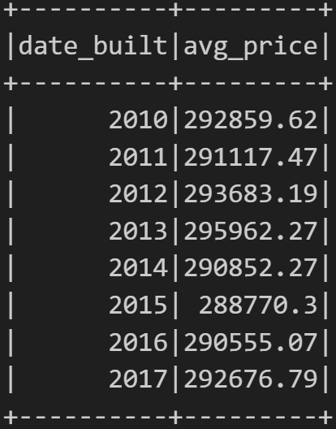

# Homes_Sales

## Analysis Overview

Use your knowledge of SparkSQL to determine key metrics about home sales data. Then use Spark to create temporary views, partition the data, cache and uncache a temporary table, and verify that the table has been uncached.

## Results:

- What is the average price for a four-bedroom house sold for each year? Round off  your answer to two decimal places.

 

- What is the average price of a home for each year the home was built, that has three bedrooms and three bathrooms? Round off your answer to two decimal places.

 

- What is the average price of a home for each year the home was built, that has three bedrooms, three bathrooms, two floors, and is greater than or equal to 2,000 square feet? Round off your answer to two decimal places.

 

- What is the average price of a home per "view" rating having an average home price greater than or equal to $350,000? Determine the run time for this query, and round off your answer to two decimal places.

 

The query run for the last questions was run also after having cached the data and after having partioned the data on the formatted parquet home sales data:

 

 

The runtimes for the different methods shows that both the queries run with the cached data are faster that the query run with the uncached data, and that the query run on the partioned data is slower that the unpartitioned one.